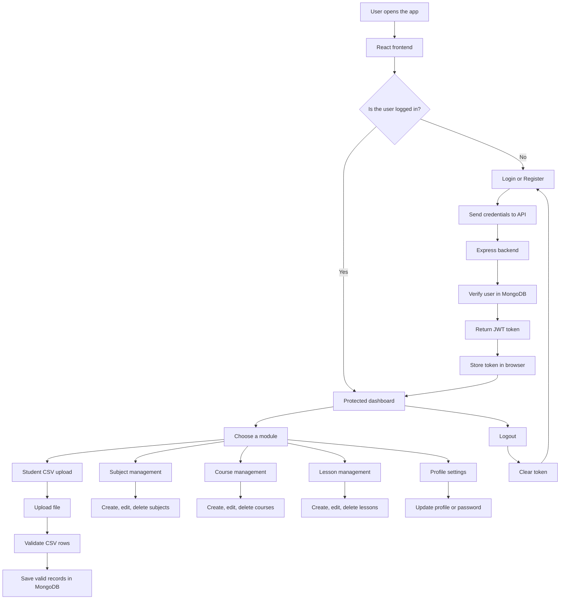
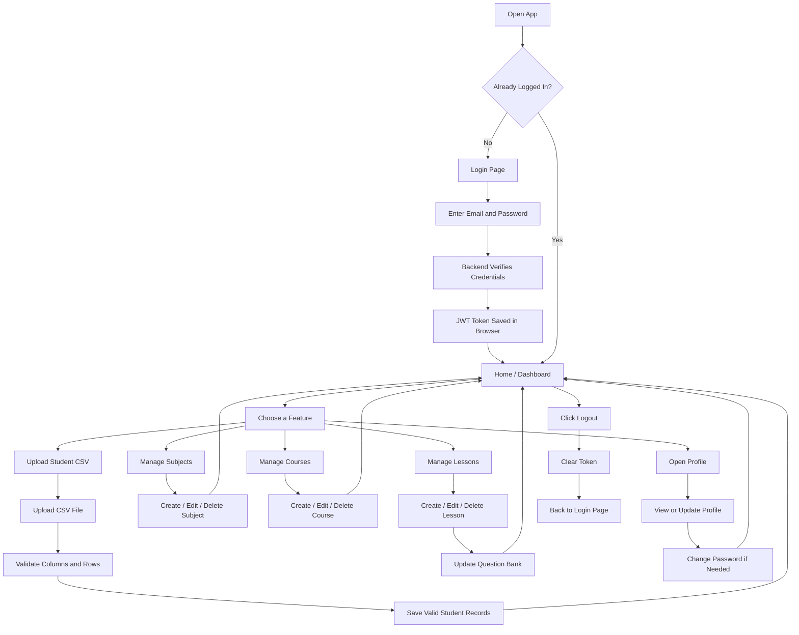

# Mini Project

This is a full-stack education and data-management application built for managing students, academic master data, and user accounts.

In simple terms:

- users create an account or log in
- the app unlocks protected pages after login
- users manage subjects, courses, lessons, and student records
- student data can be imported from CSV files
- forgotten passwords can be reset by email OTP
- the frontend communicates with an Express API
- the API stores data in MongoDB

## Project Overview

This application combines three parts:

- `Frontend`
  - the browser interface built with React
- `Backend`
  - the API layer built with Express and Node.js
- `Database`
  - persistent storage handled by MongoDB

It is designed so a user can:

- sign up or log in
- use protected modules after authentication
- manage academic records from one place
- upload bulk student data safely
- update profile details and passwords
- log out when finished

## Core Capabilities

- user registration and login
- JWT-based authentication
- protected routes on the frontend and backend
- forgot-password workflow with OTP email
- resend OTP with cooldown protection
- profile viewing and profile updates
- password change while logged in
- CSV student upload and validation
- CRUD for subjects, courses, and lessons
- lesson question bank management
- sequence-based IDs for master data
- automatic cleanup of related records when parents are deleted
- dashboard overview with record counts

## Tech Stack

### Frontend

- `React 19`
  - builds the user interface
- `Vite`
  - runs the frontend quickly in development
- `React Router`
  - moves between pages like login, profile, and dashboard
- `Axios`
  - sends API requests to the backend
- `Tailwind CSS`
  - styles the pages
- `lucide-react`
  - provides icons
- `react-hot-toast` and `react-toastify`
  - show success and error messages

### Backend

- `Node.js`
  - runs the server
- `Express`
  - handles API routes
- `MongoDB`
  - stores the data
- `Mongoose`
  - defines data models and validation
- `JWT`
  - handles login authentication
- `bcryptjs`
  - hashes passwords
- `Multer`
  - handles file uploads
- `csv-parser`
  - reads CSV files row by row
- `Nodemailer`
  - sends OTP and welcome emails
- `dotenv`
  - loads environment variables
- `cors`
  - allows frontend and backend to communicate during development

## Why These Tools Are Used

- `React` and `Vite` make the frontend fast and easy to maintain.
- `Express` keeps the backend simple and easy to understand.
- `MongoDB` is a good fit because the data is document-based.
- `Mongoose` adds structure and validation to database records.
- `JWT` lets the app keep users logged in without server sessions.
- `bcryptjs` protects passwords before they are saved.
- `Multer` and `csv-parser` work together to accept and validate CSV files.
- `Nodemailer` is needed for password reset and welcome emails.
- `Tailwind CSS` makes the UI easier to build and keep consistent.

## Data Flow



## How The App Works

### Simple Flow

1. Open the app in the browser.
2. Register or log in.
3. The backend checks your details.
4. If login is correct, a token is saved in the browser.
5. The app unlocks the protected pages.
6. You use the modules you need.
7. When you are done, click logout.
8. The token is removed and you return to the login page.

### What Happens Behind The Scenes

1. The React app sends requests to the backend through Axios.
2. The backend checks whether the request needs authentication.
3. If the request is protected, the JWT token is verified.
4. The controller validates the incoming data.
5. If the data is valid, Mongoose saves it in MongoDB.
6. For special flows like password reset or CSV upload, extra services handle email delivery and file parsing.
7. The backend returns a response to the frontend.
8. The UI updates what the user sees.

### User Journey Flow



## Beginner Setup Guide

### Before you start

Make sure you have:

- `Node.js`
- `npm`
- MongoDB running locally or a MongoDB Atlas connection string
- an email account for OTP and welcome emails

### 1. Open the project folder

```bash
cd mini_project
```

### 2. Install the backend dependencies

```bash
cd server
npm install
```

### 3. Create the backend `.env` file

Inside the `server` folder, create a file named `.env` and add:

```env
MONGO_URI=your_mongodb_connection_string
JWT_SECRET=your_jwt_secret
EMAIL_USER=your_email_address
EMAIL_PASS=your_email_password
PORT=5000
```

What each value means:

- `MONGO_URI` connects the app to MongoDB
- `JWT_SECRET` signs login tokens
- `EMAIL_USER` is the email used to send OTPs
- `EMAIL_PASS` is the password or app password for that email
- `PORT` is the backend port

### 4. Start the backend

```bash
npm run dev
```

The backend runs at:

```text
http://localhost:5000
```

### 5. Install the frontend dependencies

Open a second terminal and run:

```bash
cd client
npm install
```

### 6. Start the frontend

```bash
npm run dev
```

The frontend usually runs at:

```text
http://localhost:5173
```

## How To Use The App

### If you are a new user

1. Open the frontend in your browser.
2. Click `Register`.
3. Fill in your name, email, and password.
4. Submit the form.
5. Log in with the same email and password.

### If you already have an account

1. Open the app.
2. Log in.
3. You will land on the home page or dashboard.
4. Use the navigation bar to open any module.

### Upload student data

1. Open the CSV upload page.
2. Choose a CSV file.
3. Make sure the columns are:

```text
name,email,grade,section
```

4. Upload the file.
5. The app will show which rows were inserted, skipped, or rejected.

### Manage subjects, courses, and lessons

1. Open the correct master page.
2. Click create, edit, or delete.
3. Fill in the required details.
4. Save the record.
5. The lists and counts update automatically.

### Manage lesson question bank

1. Open a lesson.
2. Add or edit the question bank entries.
3. Save the lesson.

### Update profile or password

1. Open the profile page.
2. Edit your details if needed.
3. Use the change-password page to update your password.

### Log out

1. Click logout.
2. The token is cleared from the browser.
3. You are sent back to the login page.

## Practical Usage Notes

- The login token is stored in the browser, so closing the tab does not automatically log the user out.
- CSV upload works best when the file contains only the expected columns.
- Subject, course, and lesson data is linked, so deleting a parent record may remove dependent records too.
- Password reset emails depend on valid email credentials in the backend `.env` file.
- The frontend expects the backend to run on `http://localhost:5000`.

## Important Rules

- Passwords must be 6 to 24 characters long.
- Passwords must include at least one uppercase letter and one special character.
- CSV files must use the expected column names.
- Duplicate subject, course, and lesson records are blocked where needed.
- Deleting a subject can also remove related courses and lessons.
- Deleting a course can also remove related lessons.
- OTP links expire after a short time.

## API Summary

The backend is grouped into these major areas:

- authentication
- profile management
- student CSV import
- subject management
- course management
- lesson management

Common endpoints include:

- `POST /api/auth/register`
- `POST /api/auth/login`
- `POST /api/auth/forgot-password`
- `POST /api/auth/resend-otp`
- `POST /api/auth/reset-password`
- `GET /api/auth/profile`
- `PUT /api/auth/profile`
- `PUT /api/auth/change-password`
- `GET /api/students`
- `POST /api/students/upload`
- `GET /api/subjects`
- `POST /api/subjects`
- `PUT /api/subjects/:id`
- `DELETE /api/subjects/:id`
- `GET /api/courses`
- `POST /api/courses`
- `PUT /api/courses/:id`
- `DELETE /api/courses/:id`
- `GET /api/lessons`
- `GET /api/lessons/:id`
- `POST /api/lessons`
- `PUT /api/lessons/:id`
- `PUT /api/lessons/:id/question-bank`
- `DELETE /api/lessons/:id`

## Folder Tree

This tree shows the important files only.
`node_modules` and other generated folders are intentionally omitted.

```text
mini_project/
|-- README.md
|-- stu.csv
|-- student_details.csv
|-- student_details_2.csv
|-- client/
|   |-- index.html
|   |-- package.json
|   |-- vite.config.js
|   |-- public/
|   |   |-- favicon.svg
|   |   `-- icons.svg
|   `-- src/
|       |-- App.jsx
|       |-- main.jsx
|       |-- index.css
|       |-- assets/
|       |-- components/
|       |   |-- common/
|       |   |   |-- ConfirmModal.jsx
|       |   |   |-- DescriptionPreview.jsx
|       |   |   `-- ProtectedWrapper.jsx
|       |   `-- layout/
|       |       |-- Header.jsx
|       |       |-- Navbar.jsx
|       |       `-- Footer.jsx
|       |-- pages/
|       |   |-- Home.jsx
|       |   |-- Login.jsx
|       |   |-- Register.jsx
|       |   |-- ForgotPassword.jsx
|       |   |-- ResetPassword.jsx
|       |   |-- Profile.jsx
|       |   |-- ChangePassword.jsx
|       |   |-- MasterDashboard.jsx
|       |   |-- UploadCSV.jsx
|       |   |-- ViewData.jsx
|       |   |-- SubjectMaster.jsx
|       |   |-- CourseMaster.jsx
|       |   |-- LessonMaster.jsx
|       |   |-- LessonDetails.jsx
|       |   `-- QuestionBank.jsx
|       |-- routes/
|       |   `-- AppRoutes.jsx
|       |-- services/
|       |   |-- api.js
|       |   |-- authService.js
|       |   |-- courseService.js
|       |   |-- dataService.js
|       |   |-- lessonService.js
|       |   `-- subjectService.js
|       `-- utils/
|           |-- subjectIcons.js
|           `-- validator.js
`-- server/
    |-- package.json
    |-- server.js
    |-- app.js
    |-- config/
    |   `-- db.js
    |-- controllers/
    |   |-- authController.js
    |   |-- csvController.js
    |   |-- courseController.js
    |   |-- lessonController.js
    |   |-- studentController.js
    |   `-- subjectController.js
    |-- middleware/
    |   |-- authMiddleware.js
    |   |-- errorMiddleware.js
    |   |-- tenantMiddleware.js
    |   `-- uploadMiddleware.js
    |-- models/
    |   |-- User.js
    |   |-- Student.js
    |   |-- Subject.js
    |   |-- Course.js
    |   `-- Lesson.js
    |-- routes/
    |   |-- authRoutes.js
    |   |-- studentRoutes.js
    |   |-- subjectRoutes.js
    |   |-- courseRoutes.js
    |   `-- lessonRoutes.js
    |-- services/
    |   |-- emailService.js
    |   `-- csvService.js
    `-- utils/
        |-- csvParser.js
        `-- resequenceDocuments.js
```

## Troubleshooting

If something does not work, check these first:

- MongoDB is running
- the `.env` file exists inside `server/`
- the backend is running on port `5000`
- the frontend is running on port `5173`
- the CSV file has the correct columns
- your email credentials are correct if OTP mail is failing

## Notes For Future Additions

This README is intentionally written so it can keep growing.

You can add later:

- screenshots
- deployment steps
- test instructions
- database schema details
- example API requests and responses
- role-based access rules
- future feature roadmap
